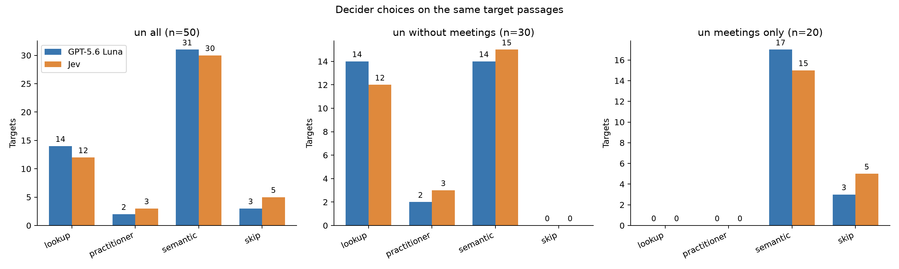
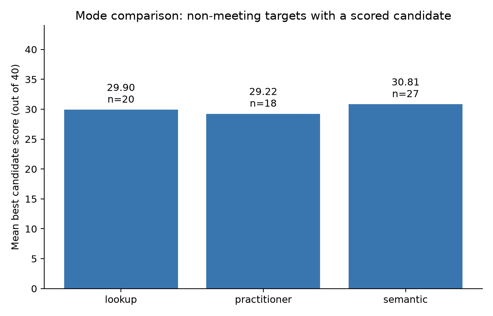

# Decider screening

Run status: **completed**. Seed 20260929; 50 UN documents and 0 EUR-Lex acts, one English target per document/act. Generator/standard decider: `gpt-5.6-luna`. Verifier: `anthropic/claude-sonnet-5.5`. Jev: `~typesafe/jev-latest`.

## Design and interpretation

The sample is deterministic and stratified, not a representative corpus-frequency estimate. UN sampling uses the existing 50% resolution, 40% meeting, 10% letter mix, full-context-fit and reference-completeness filters. The complete assembled payload is identical across both deciders and every generation mode. Each mode gets one generation batch (up to three candidates), followed by the existing faithfulness and mode-specific quality verifiers. Generation does not see either decider’s answer.

“All modes” means the modes offered to the decider: lookup/practitioner/semantic for UN and fact_pattern/lookup for EUR-Lex. Legacy technical/descriptive modes are outside this comparison. Meeting records are eligible only for semantic or skip; lookup/practitioner runs on them are diagnostic restriction checks and cannot win. Semantic remains eligible on other UN documents.

Scores use the pipeline sum: faithfulness /15 plus mode-specific quality /25 = /40. For UN, the best candidate must also have grounding ≥3. “Oracle” means the best observed eligible mode in this single run, retaining ties—not human-labeled ground truth. Different quality rubrics assess different properties, so score comparisons are screening evidence. A second sensitivity analysis requires a clear/minor-issues audit; repair, review and blocking candidates are excluded there.

Coverage-adjusted utility assigns 0 to skip or a mode with no qualifying candidate; 0 is an analysis convention, not an LLM grade. Provider/parse failures and incomplete eligible-mode comparisons are excluded from policy utility. “Missed opportunity” means a decider skipped despite another mode producing a scored candidate, not proof the skip was wrong. No accuracy claim or optimal-skip threshold is possible without human labels. Bootstrap intervals resample these targets and do not capture model rerun variability.

Original failed tasks: 8; successfully repaired: 8. Repairs reuse generation and successful verifier stages. The faithfulness retry adds only an explicit actual-batch-size instruction to avoid fabricated extra grade objects when fewer than three candidates were supplied. The grading rubric is unchanged. Original calls remain in `run.sqlite`; repair calls and provenance are in [grade_repairs/trace.md](grade_repairs/trace.md). Where surrounding prose prevented parsing, an unambiguous grade array was recovered only after validating the exact count, indices, score ranges, and required fields; no extra grade objects were silently discarded. One quality response omitted positional indices; those were restored from exact, unique candidate IDs in the recorded input, followed by full schema validation. The earliest valid recorded response was used, without changing its scores. Candidate counts vary by mode, so best-of-batch scores reflect the pipeline outcome rather than an isolated causal effect of framing.

## Mode distributions

| subset | backend | mode | count | n | percent |
| --- | --- | --- | --- | --- | --- |
| un_all | generator | lookup | 14 | 50 | 28.00 |
| un_all | generator | practitioner | 2 | 50 | 4.00 |
| un_all | generator | semantic | 31 | 50 | 62.00 |
| un_all | generator | skip | 3 | 50 | 6.00 |
| un_all | generator | error | 0 | 50 | 0.00 |
| un_all | jev | lookup | 12 | 50 | 24.00 |
| un_all | jev | practitioner | 3 | 50 | 6.00 |
| un_all | jev | semantic | 30 | 50 | 60.00 |
| un_all | jev | skip | 5 | 50 | 10.00 |
| un_all | jev | error | 0 | 50 | 0.00 |
| un_without_meetings | generator | lookup | 14 | 30 | 46.67 |
| un_without_meetings | generator | practitioner | 2 | 30 | 6.67 |
| un_without_meetings | generator | semantic | 14 | 30 | 46.67 |
| un_without_meetings | generator | skip | 0 | 30 | 0.00 |
| un_without_meetings | generator | error | 0 | 30 | 0.00 |
| un_without_meetings | jev | lookup | 12 | 30 | 40.00 |
| un_without_meetings | jev | practitioner | 3 | 30 | 10.00 |
| un_without_meetings | jev | semantic | 15 | 30 | 50.00 |
| un_without_meetings | jev | skip | 0 | 30 | 0.00 |
| un_without_meetings | jev | error | 0 | 30 | 0.00 |
| un_meetings_only | generator | lookup | 0 | 20 | 0.00 |
| un_meetings_only | generator | practitioner | 0 | 20 | 0.00 |
| un_meetings_only | generator | semantic | 17 | 20 | 85.00 |
| un_meetings_only | generator | skip | 3 | 20 | 15.00 |
| un_meetings_only | generator | error | 0 | 20 | 0.00 |
| un_meetings_only | jev | lookup | 0 | 20 | 0.00 |
| un_meetings_only | jev | practitioner | 0 | 20 | 0.00 |
| un_meetings_only | jev | semantic | 15 | 20 | 75.00 |
| un_meetings_only | jev | skip | 5 | 20 | 25.00 |
| un_meetings_only | jev | error | 0 | 20 | 0.00 |

## All-mode score comparison

| subset | mode | eligible | scored | generated_candidates | no_candidates | mean_best_score | mean_best_faithfulness | mean_best_quality | oracle_wins_including_ties | best_candidate_blocking | audit_clear_targets |
| --- | --- | --- | --- | --- | --- | --- | --- | --- | --- | --- | --- |
| un_all | lookup | 30 | 20 | 41 | 10 | 29.90 | 13.85 | 16.05 | 7 | 11 | 10 |
| un_all | practitioner | 30 | 18 | 39 | 12 | 29.22 | 14.17 | 15.06 | 4 | 10 | 7 |
| un_all | semantic | 50 | 45 | 104 | 5 | 30.67 | 13.33 | 17.33 | 40 | 6 | 30 |
| un_without_meetings | lookup | 30 | 20 | 41 | 10 | 29.90 | 13.85 | 16.05 | 7 | 11 | 10 |
| un_without_meetings | practitioner | 30 | 18 | 39 | 12 | 29.22 | 14.17 | 15.06 | 4 | 10 | 7 |
| un_without_meetings | semantic | 30 | 27 | 61 | 3 | 30.81 | 13.33 | 17.48 | 22 | 2 | 19 |
| un_meetings_only | lookup | 0 | 0 | 0 | 0 | — | — | — | 0 | 0 | 0 |
| un_meetings_only | practitioner | 0 | 0 | 0 | 0 | — | — | — | 0 | 0 | 0 |
| un_meetings_only | semantic | 20 | 18 | 43 | 2 | 30.44 | 13.33 | 17.11 | 18 | 4 | 11 |

## Decider performance against observed scores

| subset | backend | routed | scored_selected | skipped | matches_oracle | oracle_available | missed_score_opportunities | selected_mode_unproductive_despite_alternative | mean_selected_score_when_available | mean_regret_when_scored | mean_utility_zero_for_skip_or_no_candidate | mean_audit_clear_utility | mean_oracle_utility |
| --- | --- | --- | --- | --- | --- | --- | --- | --- | --- | --- | --- | --- | --- |
| un_all | generator | 47 | 39 | 3 | 29 | 46 | 2 | 5 | 30.64 | 0.64 | 23.90 | 15.22 | 28.42 |
| un_all | jev | 45 | 41 | 5 | 31 | 46 | 4 | 1 | 30.73 | 0.51 | 25.20 | 16.44 | 28.42 |
| un_without_meetings | generator | 30 | 23 | 0 | 13 | 28 | 0 | 5 | 30.39 | 1.09 | 23.30 | 13.60 | 29.10 |
| un_without_meetings | jev | 30 | 27 | 0 | 17 | 28 | 0 | 1 | 30.44 | 0.78 | 27.40 | 15.63 | 29.10 |
| un_meetings_only | generator | 17 | 16 | 3 | 16 | 18 | 2 | 0 | 31 | 0 | 24.80 | 17.65 | 27.40 |
| un_meetings_only | jev | 15 | 14 | 5 | 14 | 18 | 4 | 0 | 31.29 | 0 | 21.90 | 17.65 | 27.40 |

## Paired Jev versus standard-decider comparison

| subset | valid_pairs | agree | generator_better_utility | jev_better_utility | utility_ties | mean_paired_utility_difference_generator_minus_jev | bootstrap_95_interval |
| --- | --- | --- | --- | --- | --- | --- | --- |
| un_all | 50 | 37 | 4 | 8 | 38 | -1.30 | [-4.66, 1.98] |
| un_without_meetings | 30 | 19 | 2 | 8 | 20 | -4.10 | [-8.8, 0.06666666666666667] |
| un_meetings_only | 20 | 18 | 2 | 0 | 18 | 2.90 | [0, 7.3] |

## Disagreements for manual review

| symbol | target_id | generator_mode | jev_mode | oracle_modes | lookup_score | practitioner_score | semantic_score |
| --- | --- | --- | --- | --- | --- | --- | --- |
| A/RES/56/160 | 2002/a/res/56/160#6 | lookup | practitioner | semantic | — | 28 | 31 |
| A/HRC/DEC/24/117 | 2013/a/hrc/dec/24/117#0 | semantic | lookup |  | — | — | — |
| A/RES/60/140 | 2005/a/res/60/140#5 | semantic | lookup | lookup | 28 | — | — |
| A/RES/65/133 | 2011/a/res/65/133#13 | practitioner | semantic | semantic | 32 | 28 | 33 |
| A/RES/61/173 | 2006/a/res/61/173#1 | lookup | semantic | semantic | — | — | 29 |
| E/RES/2014/23 | 2014/e/res/2014/23#3 | lookup | semantic | semantic | — | — | 31 |
| A/RES/57/124 | 2003/a/res/57/124#2 | semantic | lookup | semantic | 29 | 27 | 31 |
| A/RES/57/183 | 2003/a/res/57/183#9 | lookup | semantic | semantic | 31 | — | 32 |
| A/HRC/RES/25/6 | 2014/a/hrc/res/25/6#7 | lookup | practitioner | semantic | 25 | 28 | 29 |
| A/RES/60/129 | 2005/a/res/60/129#8 | semantic | practitioner | semantic | — | — | 30 |
| A/RES/67/276 | 2013/a/res/67/276#2 | practitioner | semantic | semantic | 29 | — | 30 |
| CD/PV.1063 | 2007/cd/pv_1063#7 | semantic | skip | semantic | — | — | 28 |
| GC.15/SR.9 | 2014/gc_15/sr_9#10 | semantic | skip | semantic | — | — | 30 |

## Recorded usage

| stage | model | calls | provider_errors | prompt_tokens | completion_tokens | reported_cost | calls_missing_cost |
| --- | --- | --- | --- | --- | --- | --- | --- |
| decider | ~typesafe/jev-latest | 50 | 0 | 231246 | 2462 | 0.01 | 0 |
| generation | gpt-5.6-luna | 150 | 0 | 1231577 | 131248 | 0 | 150 |
| decider | gpt-5.6-luna | 50 | 0 | 196309 | 10339 | 0 | 50 |
| faithfulness | anthropic/claude-sonnet-5.5 | 125 | 0 | 985482 | 71375 | 2.68 | 0 |
| quality | anthropic/claude-sonnet-5.5 | 95 | 0 | 811161 | 165843 | 3.28 | 0 |
| faithfulness_repair | anthropic/claude-sonnet-5.5 | 10 | 0 | 97508 | 2924 | 0.22 | 0 |
| quality_repair | anthropic/claude-sonnet-5.5 | 3 | 0 | 22032 | 3631 | 0.08 | 0 |

Reported cost is in USD where provided. Missing provider costs are unknown, not zero.

## Artifacts

- [Documents and full source payloads](documents.csv)
- [Documents and decisions, including reasons/probabilities](decisions.csv)
- [Per-document comparison and regrets](document_comparison.csv)
- [All generated questions and verifier grades](all_mode_candidates.csv)
- [Per-target mode scores, questions, answers and statuses](mode_scores.csv)
- [Mode distributions](mode_distribution.csv)
- [Decider metrics](decider_performance.csv)
- [Pairwise confusion counts](confusion.csv)
- [Provider call trace](trace.md) and [raw trace](llm_calls.json)
- [Reproducible configuration](config.json), [selection](selection.json), and `run.sqlite`
